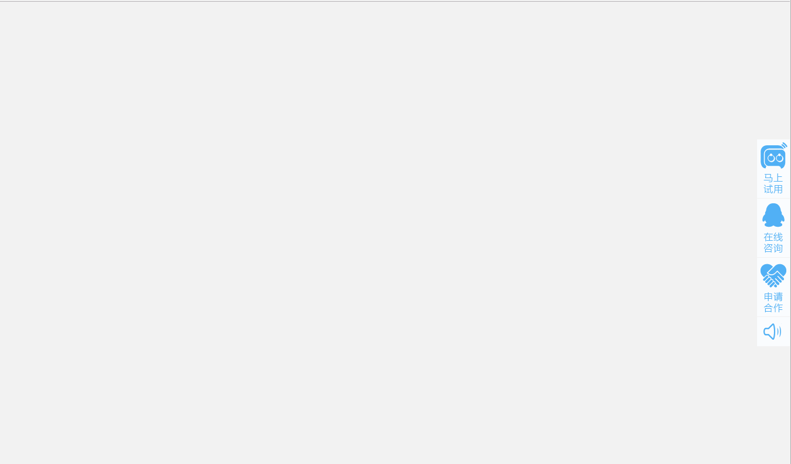

# jquery常用网站右侧侧边栏功能 sidebar

效果如下：


html code:
```
<!doctype html>
<html lang="en">
<head>
	<meta charset="UTF-8">
	<title>js带语音的右侧悬浮在线客服代码</title>
	<link rel="stylesheet" href="css/zxkf.css"/>
</head>
<body>
<!-- 代码 开始 -->
<audio id="bgMusic" src="lrtk.mp3" autoplay="autoplay" loop="loop"></audio>
<div id="service">
	<a href="javascript:void(0)" class="srvLog" target="_blank">申请试用</a>
	<a class="srvCns" href="tencent://message/?uin=285772998&Site=企业网站&Menu=yes">在线咨询</a>
	<a href="javascript:void(0)" class="srvDj" target="_blank">申请合作</a>
	<a class="mscBtn" id="audioBtn" title="开关音效">开关音效</a>
	<a class="goTop" id="goTop" title="返回顶部" style="display:none">返回顶部</a>
	<div style="text-align:center;margin:100px 0 900px 0;"></div>
		<!-- 代码 结束 -->
</div>
</body>
</html>
<script src="js/jquery.js"></script>
<script src="js/service.js"></script>
```

js code:
```
(function() {

    // 返回顶部按钮自动隐藏
    $(window).scroll(function(){
        if ($(window).scrollTop()>200){
            $('#goTop').fadeIn();
        }else if($(window).scrollTop()<200){
            $('#goTop').fadeOut();
        }
    });

    $('#goTop').click(function() {
        $("html, body").animate({scrollTop:0}, 200);
    });


    var music = document.getElementById("bgMusic");

    $("#audioBtn").click(function(){

        if(music.paused){
            music.play();
            $("#audioBtn").removeClass("pause").addClass("play");
        }else{
            music.pause();
            $("#audioBtn").removeClass("play").addClass("pause");
        }
    });

})();

```

